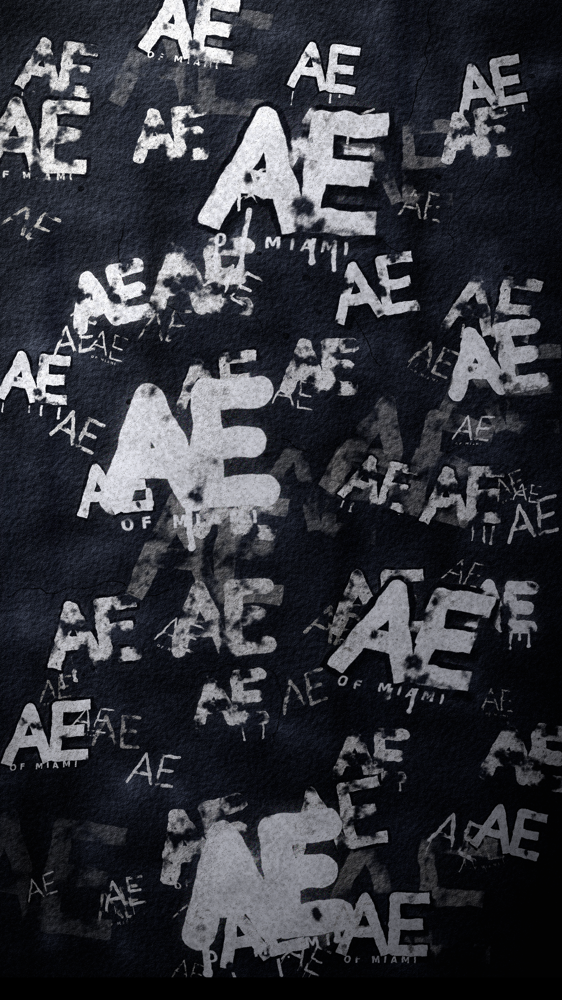

# AE of Miami — graffiti wall background

Fondo vertical **2160 × 3840** (9:16, 4K para móvil / stories): el monograma
**AE of Miami** en blanco, grafiteado muchas veces sobre un muro de hormigón
negro, integrado en la superficie en lugar de pegado encima.



## Archivos

| Archivo | Qué es |
| --- | --- |
| `ae-miami-graffiti-wall-2160x3840.png` | El fondo final, listo para usar |
| `generate.js` | Genera `wall.html` (un solo SVG a pantalla completa) |
| `render.sh` | Regenera el HTML y lo captura a PNG con Chromium |
| `wall.html` | Salida intermedia, editable en el navegador |
| `measure.py` | Mide luminancia media/percentiles del PNG (para calibrar) |

Todo es vectorial y procedural: no hay fotos ni bitmaps de origen, así que se
regenera a cualquier resolución sin perder nitidez.

## Regenerar

```bash
./render.sh                      # -> ae-miami-graffiti-wall-2160x3840.png
./render.sh /ruta/otro-nombre.png
```

Requiere Node y Chromium (`CHROME=/ruta/al/chrome ./render.sh` para otro
binario). El render completo tarda ~2 min: el pase de material recorre los
8,3 M de píxeles con varias capas de ruido e iluminación.

## Cómo se consigue el realismo

La clave es **no tratar la pintura como una calcomanía**. Color de muro y
pintura blanca entran juntos en una sola capa de albedo, y un único campo de
altura lo ilumina todo a la vez:

1. **Campo de altura** — tres bandas de octavas (agregado fino, grano medio,
   ondulación gruesa) mezcladas con `feComposite` aritmético.
2. **Difusa** — `feDiffuseLighting` con luz rasante a 34° da la forma del
   hormigón. Se multiplica por el albedo, así que la pintura recibe exactamente
   la misma iluminación que el muro.
3. **Especular** — un lóbulo estrecho devuelve los destellos del árido. Es
   aditivo, no depende del albedo, y por eso es lo que hace visible la textura
   sobre negro.
4. **Poros** — la mitad profunda del campo de altura vuelve a morder por
   encima de todo, así que el grano del muro atraviesa el blanco.
5. **Pase de cámara** — caída de luz, bloom, viñeteo, curva de grado y ruido de
   sensor.

Las letras se redibujan en cada pieza: la polilínea se subdivide y cada punto
interior se desplaza perpendicularmente (una lata en la mano nunca traza
recto), y cada trazo se pinta en dos pasadas con grosores ligeramente
distintos, que es lo que da el borde irregular.

## El desgaste va por erosión, no por transparencia

La pintura vieja **no se vuelve translúcida — se cae**. Bajar la opacidad para
simular antigüedad deja un gris lavado que delata al instante que aquello nunca
fue pintura. Así que cada pieza pasa por un filtro `wear{nivel}_{semilla}` que
mantiene el blanco totalmente opaco donde sobrevive y le arranca el alfa donde
no:

- **Placas** — ruido de baja frecuencia con rampa de alfa abrupta: zonas enteras
  del trazo desaparecidas, como una capa que se descascarilla del muro.
- **Chalking** — moteado más fino y disperso para el polvillo de la pintura
  envejecida. Si se sube demasiado deja de leerse como desgaste y empieza a
  parecer tramado de impresión.
- Tres niveles (`wear0` apenas tocado, `wear2` medio comido) × tres semillas,
  para que dos piezas de la misma edad no se erosionen igual.

Encima de todo va una capa de **mugre** que corre por delante del grafiti: la
suciedad no respeta lo que se pintó antes que ella, y nada envejece un muro más
rápido que la roña cruzando las letras.

Las piezas van en cuatro profundidades — fantasmas antiguos, campo medio,
piezas frescas y tags de rotulador — con overspray, chorretones y bordes
desplazados por ruido.

## Ajustes rápidos

En `generate.js`:

- `W` / `H` — el formato (`3840 × 2160` horizontal, `3000 × 3000` cuadrado).
  Pasa el mismo `--window-size` en `render.sh`.
- `makeRng(20260815)` — la semilla. Otra distribución, mismo estilo.
- `WHITES` — los blancos (fresco / desgastado / apagado). Aquí se cambiaría la
  pintura de color si alguna vez hiciera falta.
- Bloques de composición (`ghost`, `mid`, `hero`, `tag`) — cantidad, escala y
  densidad de cada capa.
- Filtro `grade` — la curva final. `slope` sube el contraste; `intercept` baja
  las sombras. Calibrado con `measure.py` para dejar el muro en ~28/255 y el
  blanco en ~220/255.

## Dos trampas que costaron encontrar

- Los filtros SVG trabajan por defecto en **`linearRGB`**, lo que convierte
  cualquier curva de gamma en un lavado sobre fondo negro. El CSS fuerza
  `color-interpolation-filters: sRGB`.
- Multiplicar albedo por difusa **comprime todo hacia el medio**: el muro nunca
  llega a negro ni la pintura a blanco. Subir la ganancia no lo arregla —
  satura el blanco y se lleva por delante el grano. Se resuelve al final, con
  la curva de grado.
